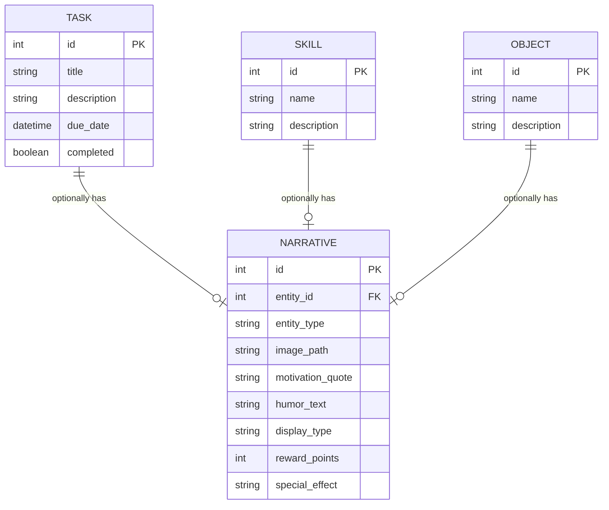

# ER図

```mermaid
erDiagram
    TASK ||--o| NARRATIVE : "optionally has"
    SKILL ||--o| NARRATIVE : "optionally has"
    OBJECT ||--o| NARRATIVE : "optionally has"
    TASK {
        int id PK
        string title
        string description
        datetime due_date
        boolean completed
    }
    SKILL {
        int id PK
        string name
        string description
    }
    OBJECT {
        int id PK
        string name
        string description
    }
    NARRATIVE {
        int id PK
        int entity_id FK
        string entity_type
        string image_path
        string motivation_quote
        string humor_text
        string display_type
        int reward_points
        string special_effect
    }
```
